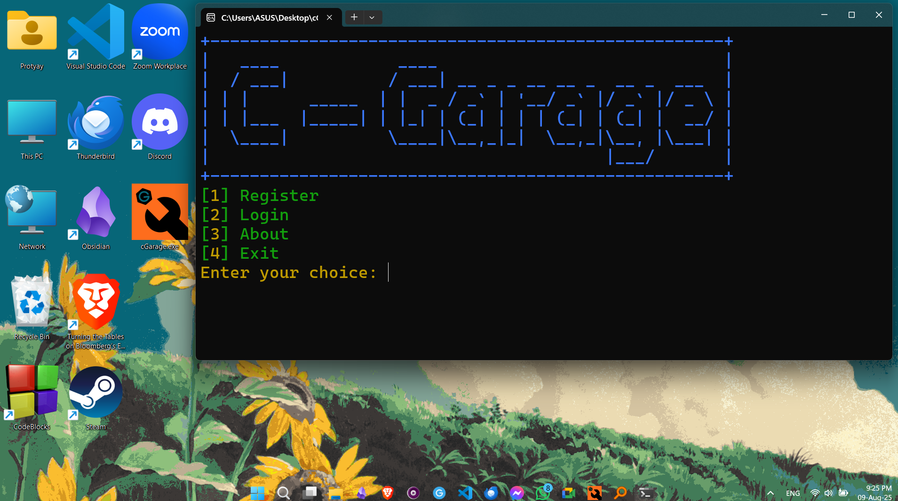

# cGarage

<p align="center">
  
</p>

A standalone console-based **garage service management system** written in C. It helps garage owners manage customer data, services, invoices, and more — all from a lightweight, terminal interface.


## 📦 Features

- 📋 Add, update, delete customer records  
- 🛠 Manage service entries (repairs, maintenance, parts)  
- 🧾 Generate and print service invoices  
- 🔍 Search by customer name, phone, or vehicle  
- 💾 Save/load data from files for persistence


## User Interface

<p align="center">
  
</p>


## 🏁 Getting Started

### 🔧 Prerequisites

- GCC or any C compiler

### 📥 Clone the Repository

```bash
git clone https://github.com/propmk/cGarage.git
